# 🌟 Project Title: Board Gender Diversity and Corporate Financial Performance in UK Commercial Banks (FTSE 100)

## 👩‍💼 Summary

This dissertation project presents a quantitative panel data analysis of four leading UK commercial banks (Barclays, HSBC, Lloyds, and NatWest) from 2010 to 2023. The study investigates the relationship between corporate governance variables and financial performance (Return on Assets, ROA), applying advanced econometric techniques to address key questions in modern corporate governance.

## 🎯 Key Findings & Policy Implications

The Random Effects Model results yielded clear, policy-relevant findings:

* [cite_start]**Gender Diversity Matters:** Board Gender Diversity demonstrated a statistically **significant positive impact** on Return on Assets (ROA)[cite: 299]. [cite_start]An increase in the board's gender diversity by 1% is associated with a 2.05% improvement in financial performance, holding other factors constant [cite: 299] [cite_start](Random Effects Regression Coefficient: **0.0205**, $p < 0.05$ [cite: 296]). [cite_start]This supports the idea that diverse boards enhance decision-making [cite: 313] [cite_start]and is in line with the UK's corporate governance reforms[cite: 278].
* [cite_start]**Leverage Risk:** The control variable, Leverage (Total Liabilities/Total Assets), showed a strong and statistically **significant negative relationship** with ROA (Coefficient: **-0.0011**, $p < 0.01$ [cite: 296, 303]). [cite_start]This highlights that higher reliance on debt financing is linked to lower profitability, aligning with the concept that higher financial risk negatively impacts performance[cite: 319, 320].
* [cite_start]**Non-Significant Factors:** The study found **no statistically significant impact** of Board Size or Board Independence on financial performance (ROA)[cite: 304, 321].

## 🛠️ Methodology

[cite_start]The analysis was conducted using a **Balanced Panel Data** approach, covering **56 observations** across the four banks from 2010 to 2023[cite: 119].

| Aspect | Detail |
| :--- | :--- |
| **Model** | [cite_start]**Random Effects Model (REM)** [cite: 294][cite_start], validated by a **Hausman Test** (p-value = 0.8671)[cite: 291]. |
| **Variables** | [cite_start]**Dependent:** Return on Assets (ROA)[cite: 156]. [cite_start]**Independent (Core):** Gender Diversity, Board Size, Board Independence[cite: 160]. [cite_start]**Control:** Firm Size (Total Assets), Leverage[cite: 160]. |
| **Software** | [cite_start]**RStudio** for data manipulation, panel data estimation (`plm`), and visualization (`ggplot2`)[cite: 150, 151]. |

## 📊 Analysis and Visual Results

The project is driven by visual analysis of trends and robust econometric results.

### Descriptive Statistics & Correlation

| Table/Chart | Insight |
| :--- | :--- |
| **** | [cite_start]Shows the high average level of Board Independence (74%) and the progression of Gender Diversity (average 29.8%)[cite: 223, 227]. |
| **** | [cite_start]Confirmed a moderately positive correlation between Gender Diversity and ROA (0.3192), and a significant negative correlation for Leverage and ROA (-0.5561)[cite: 283, 284]. |

### Key Variable Trends (2010–2023)

| Governance/Performance Variable | Bank Example | Key Trend |
| :--- | :--- | :--- |
| **Gender Diversity** |  | [cite_start]Shows a consistent and strong upward trend, nearing the 40% mark, reflecting adherence to corporate governance initiatives[cite: 277, 278]. |
| **ROA** |  | [cite_start]Illustrates significant profitability enhancement, moving from negative to consistent positive values post-2015[cite: 266]. |
| **Board Independence** |  | [cite_start]Shows a generally high level of independence, albeit with some volatility, underscoring the role of non-executive directors[cite: 243, 59]. |
| **Board Size** |  | [cite_start]Demonstrates efforts to maintain a consistent board size, which is noted to be less volatile than some peers[cite: 234]. |

### Control Variable Trends

| Control Variable | Bank Example | Key Trend |
| :--- | :--- | :--- |
| **Firm Size** |  | [cite_start]Illustrates the asset movement of a large, volatile bank, reflecting diverse asset management and operational approaches[cite: 251, 252]. |
| **Leverage** |  | [cite_start]Shows a general decline until the mid-2010s, followed by an increase, reflecting post-crisis deleveraging and later expansion strategies[cite: 258, 260]. |

### Final Econometric Results

| Test/Model | Result/Significance |
| :--- | :--- |
| **Hausman Test** | [cite_start] (P-value: 0.8671) – **Fail to Reject Null** (Random Effects suitable)[cite: 291, 293]. |
| **Random Effects Model** | [cite_start] (Gender Diversity $p < 0.05$, Leverage $p < 0.01$) – The model is statistically significant with an F-statistic of **37.37*** ($p < 0.01$)[cite: 296, 306]. |

---

## 🔗 Repository Structure

* `/data/`: Raw data collected from annual reports (not included).
* `/analysis/`: **Contains the full set of visualizations and econometric outputs.**
    * `Board_Independence_*`
      **BARCLAYS Visualization**
      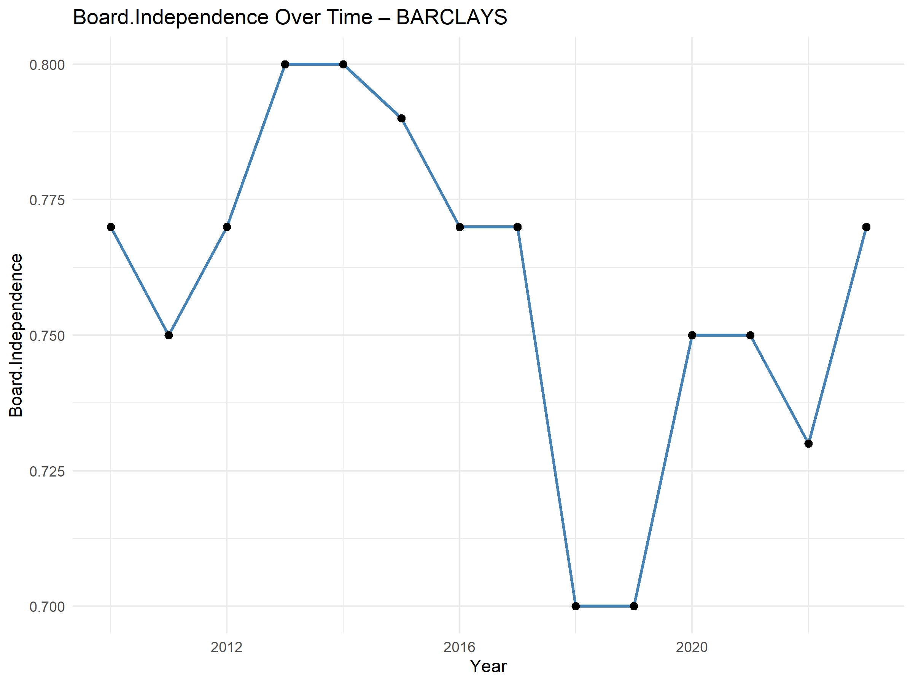
      **HSBC Visualization**
       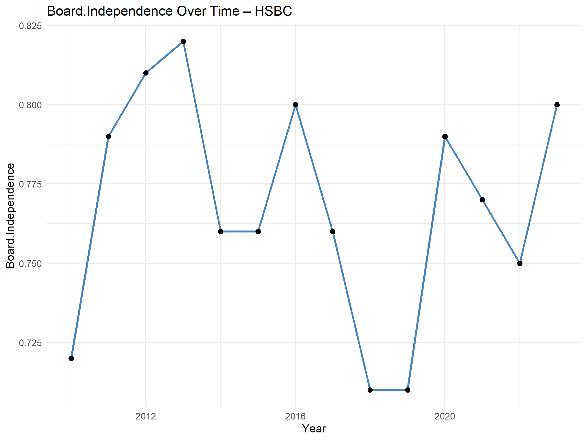
      **LLOYDS Visualization**
       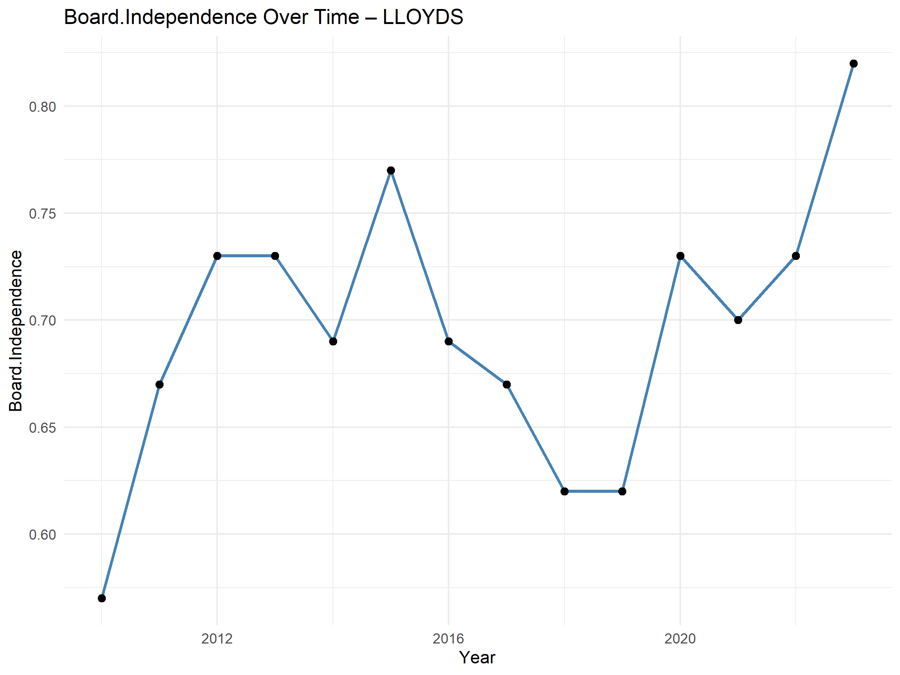
      **NATWEST Visualization**
       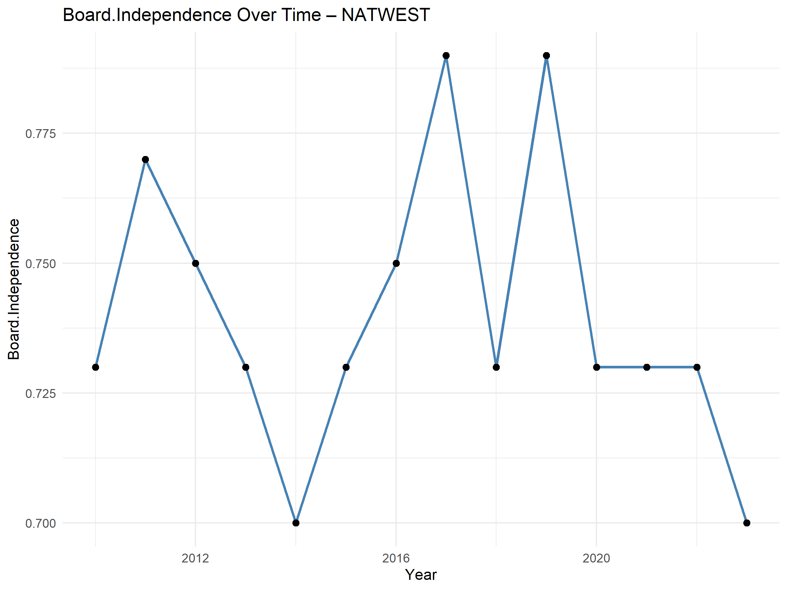

    * `Board_Size_*`
      **BARCLAYS Visualization**
      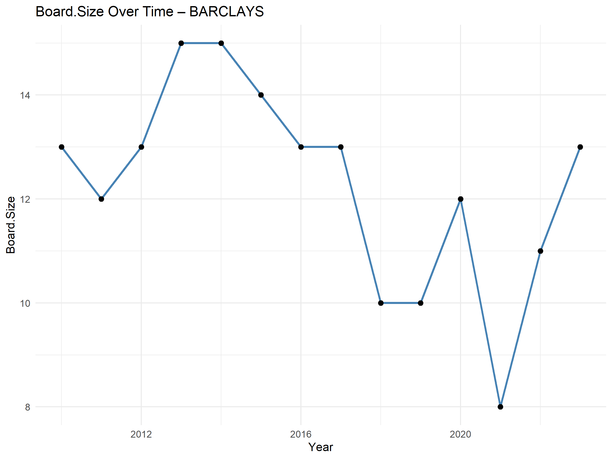
      **HSBC Visualization**
       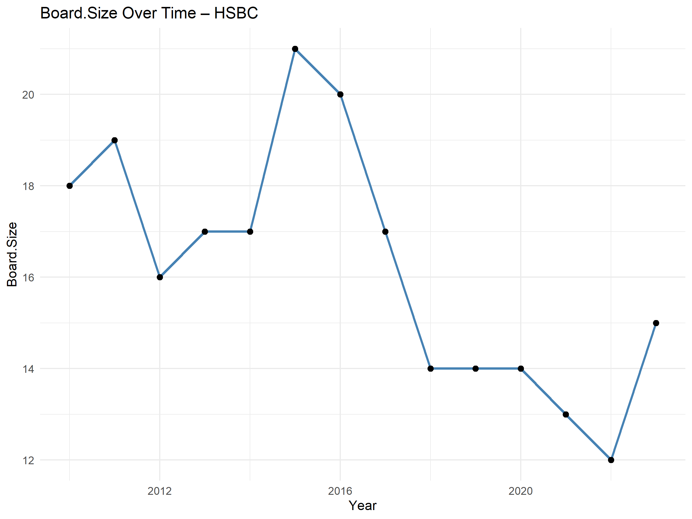
      **LLOYDS Visualization**
       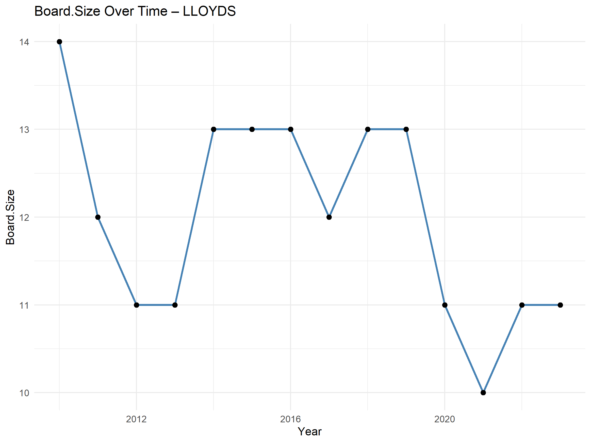
      **NATWEST Visualization**
       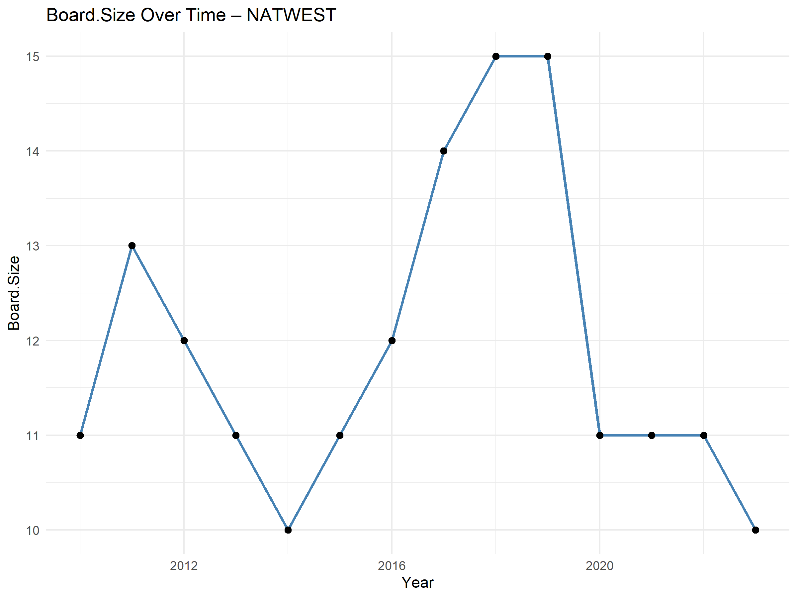
    * `ROA_*`
      **BARCLAYS Visualization**
      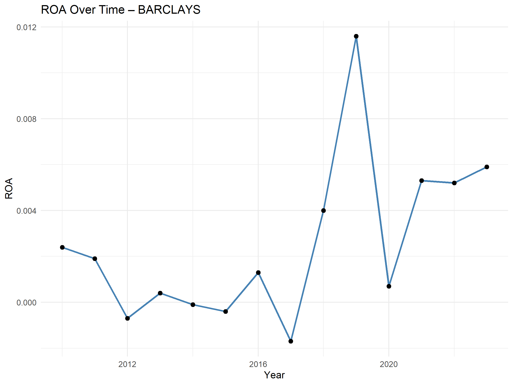
      **HSBC Visualization**
       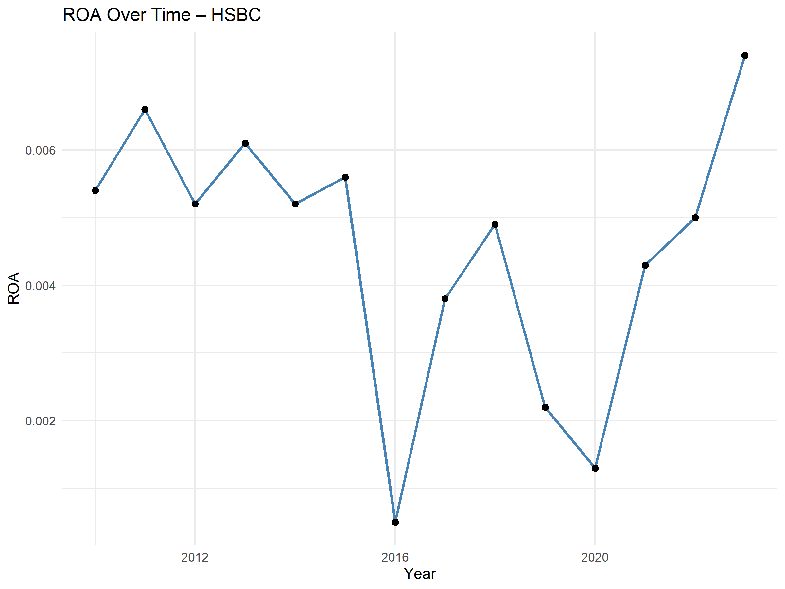
      **LLOYDS Visualization**
       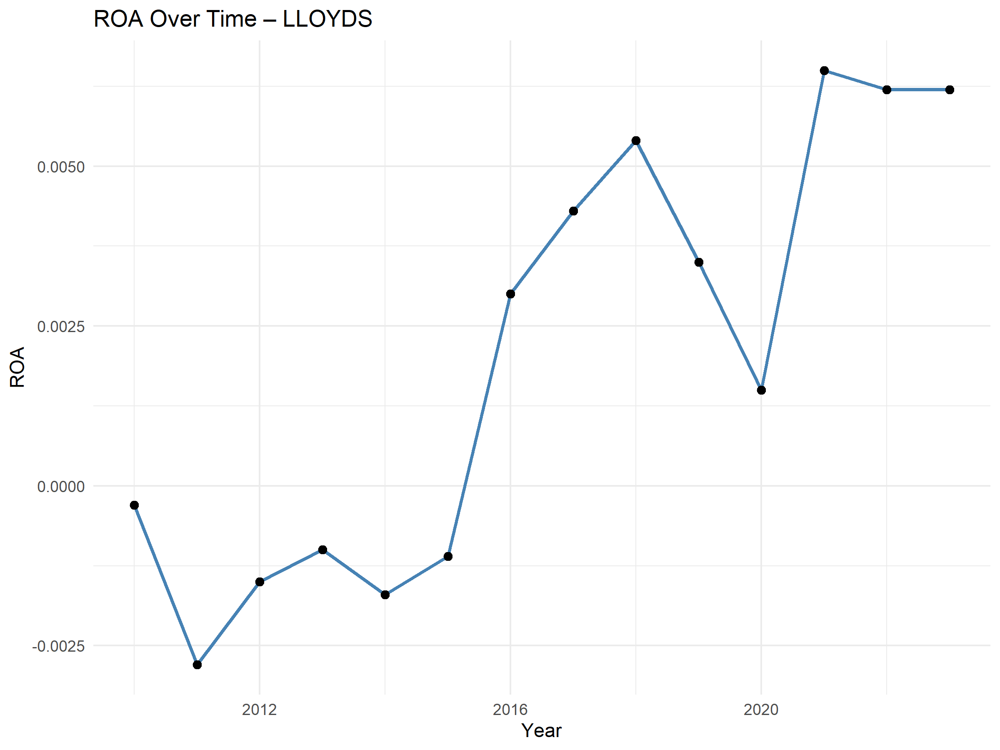
      **NATWEST Visualization**
       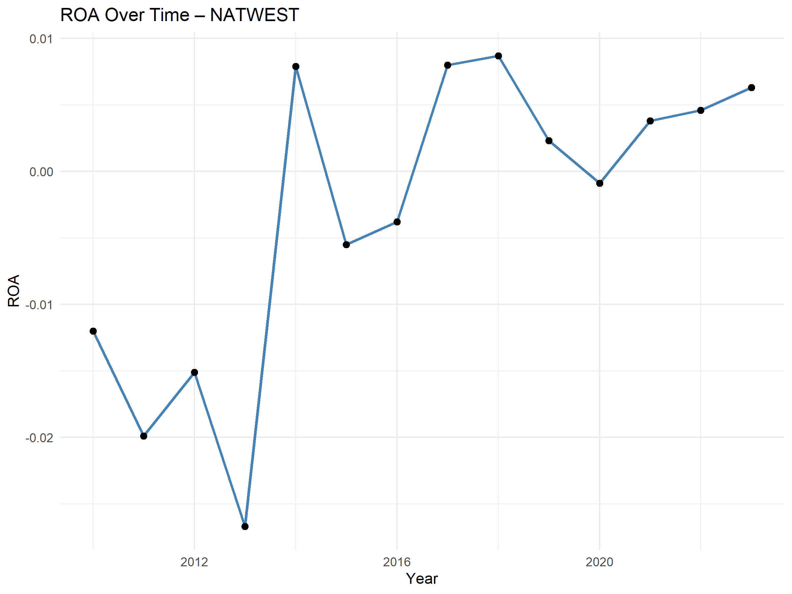
      
    * `Gender_Diversity_*.png`
      **BARCLAYS Visualization**
      
      **HSBC Visualization**
       
      **LLOYDS Visualization**
       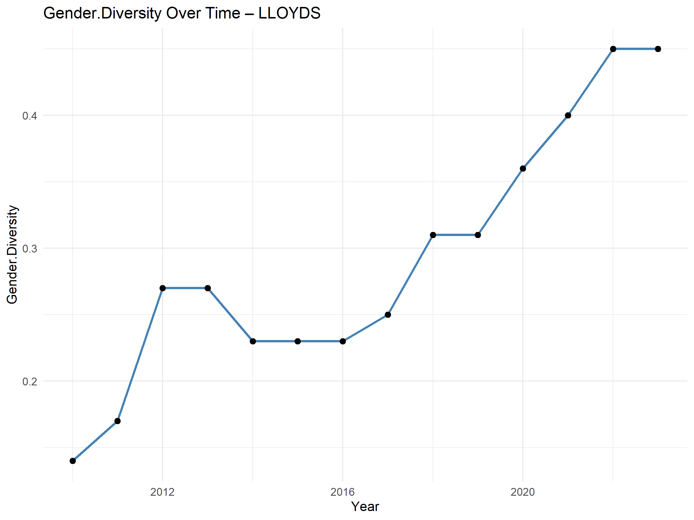
      **NATWEST Visualization**
       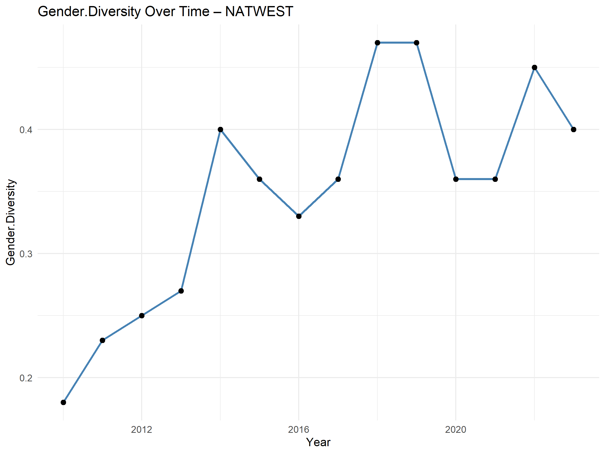
    * 
    * ... (and other result files)
* `OKEKE CHUKWUDUMEBI BEULAH - BSc Dissertation pdf.pdf`: Full dissertation document.
* `README.md`: This file.
