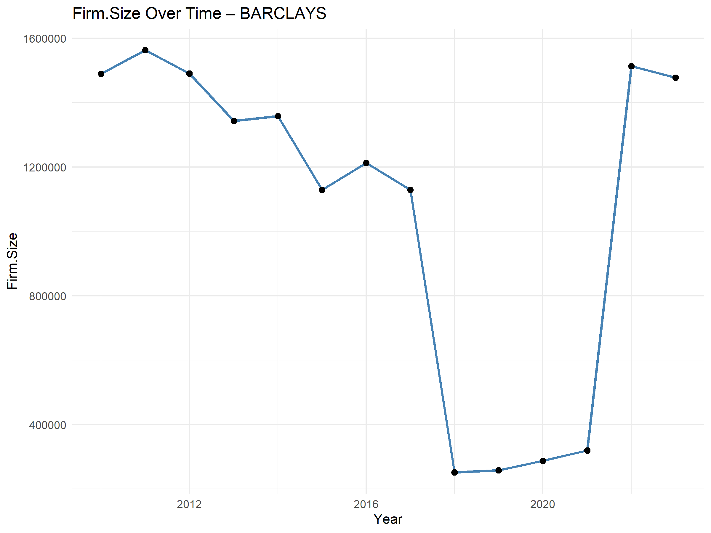

# Board-Gender-Diversity-UK-Banks.
An econometric study on board gender diversity and financial performance in UK commercial banks using panel data (2010 - 2023).

Board Gender Diversity and Financial Performance of UK Banks (2010–2023)

📊 Econometric Analysis using Panel Data in R

Author: Chukwudumebi Beulah Okeke
BSc Economics Dissertation, University of Essex (2025)

📌 Project Overview
This project investigates the relationship between board gender diversity and the financial performance of UK commercial banks listed under the FTSE 100 (Lloyds, HSBC, NatWest, Barclays) between 2010 and 2023.
The study applies panel data econometric techniques in R to examine how board composition affects profitability, measured by Return on Assets (ROA).

🎯 Research Objectives
Analyse the impact of board gender diversity on financial performance.
Evaluate how firm-level variables (board size, leverage, independence, firm size) influence ROA.
Test whether increasing female board representation improves profitability in the UK banking sector.

📂 Data
Source: Hampton-Alexander Review (2016–2021), FTSE Women Leaders Review (2022–2023), and banks’ annual reports.
Sample: 4 banks × 14 years = 56 panel observations.
Variables:
Board Diversity (gender ratio)
Board Size
Independent/Non-Executive Directors
Firm Size (total assets)
Leverage (liabilities/assets)
Return on Assets (ROA)

⚙️ Methodology
Econometric Techniques:
Pooled OLS, Fixed Effects (FE), Random Effects (RE) models.
Hausman Test to select between FE and RE.
Correlation analysis.
Tools:
RStudio
Packages: plm, ggplot2, stargazer
Regression Model:
ROA_it = β0 + β1(GenderDiversity_it) + β2(FirmSize_it) 
       + β3(BoardSize_it) + β4(Leverage_it) 
       + β5(BoardIndependence_it) + ε_t

📊 Key Findings
Positive Impact: A 1% increase in gender diversity on boards is associated with a 2.05% increase in ROA.
Firm Size: Slight positive but weak effect on ROA.
Leverage: Higher leverage negatively impacts profitability.
Board Size & Independence: No statistically significant effect.
R² = 42.8% → model explains ~43% of variation in ROA.
Conclusion: Increasing female board representation can enhance financial performance in UK banks, aligning with global corporate governance reforms.

📈 Visualisations (examples you can add as .png or generate in R)
Trend of gender diversity (2010–2023)
Bank leverage patterns over time
ROA variation across banks
 
**first screenshot**
)

**second screenshot**

🚀 How to Reproduce
Clone the repo:
git clone https://github.com/yourusername/Board-Gender-Diversity-UK-Banks.git
Open the R scripts in RStudio.
Install required packages:
install.packages(c("plm", "ggplot2", "stargazer"))
Run the analysis scripts to replicate regression results and graphs.

📜 Citation
Okeke, C.B. (2025). Board Gender Diversity and Financial Performance of UK Banks Quoted in FTSE 100. BSc Dissertation, University of Essex.
